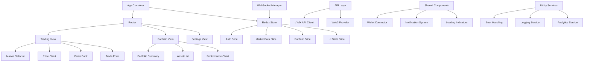

```mermaid
graph TD
    A[App Container] --> B[Redux Store]
    A --> C[Router]
    
    C --> D[Trading View]
    C --> E[Portfolio View]
    C --> F[Settings View]

    B --> G[Auth Slice]
    B --> H[Market Data Slice]
    B --> I[Portfolio Slice]
    B --> J[UI State Slice]

    K[API Layer] --> L[dYdX API Client]
    K --> M[Web3 Provider]

    D --> N[Market Selector]
    D --> O[Price Chart]
    D --> P[Order Book]
    D --> Q[Trade Form]

    E --> R[Portfolio Summary]
    E --> S[Asset List]
    E --> T[Performance Chart]

    U[Shared Components] --> V[Wallet Connector]
    U --> W[Notification System]
    U --> X[Loading Indicators]

    Y[Utility Services] --> Z[Error Handling]
    Y --> AA[Logging Service]
    Y --> AB[Analytics Service]

    AC[WebSocket Manager] --> B
```